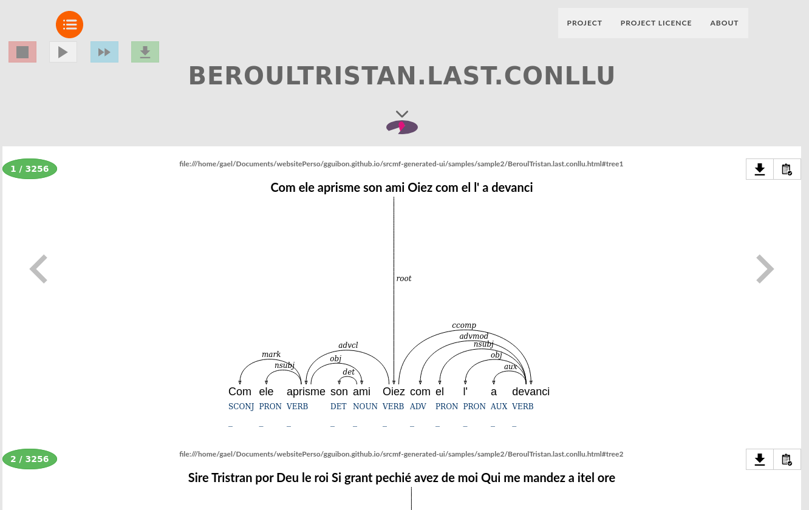

Arborator Site
===============

Arborator Site is a graphical tool which allows to browse treebanks graphically. It was initially made for the [RHAPSODIE](http://www.projet-rhapsodie.fr/) projet purposes. Its main assets are :
- create multiple projects with metada, licence information, project descriptions, etc. and save them.
- generate server ready web interface from your project
- no need to change your data ! With [Arborator's engine](http://arborator.ilpga.fr/), it reads most common treebank data and even oral speeches treebanks !
- Fast interface
- etc.


The actual version is [0.9.2-beta](https://github.com/Arborator/arborator-site/releases/tag/0.9.2-beta). 

The manager UI is an evolution of [this tutorial from code.makery](http://code.makery.ch/library/javafx-8-tutorial/ "code.makery tutorial") with several additionnal features.

# Project using Arborator Site

Here is a website generated by Arborator Site : [https://gguibon.github.io/srcmf-generated-ui/](https://gguibon.github.io/srcmf-generated-ui/)



# Build

This repo is built using the build.fxbuild file. You can build by importing the project in eclipse and build it, by directly executing the .fxbuild script.
The tutorial (link above) shows you an easy way to build its the "deployment" section.
Please import the dependencies in the "libs" directory before building it.

# Usage

There are two executable files in the root directory:
- [arborator-site-{version}.jar](https://github.com/Arborator/arborator-site/releases/tag/0.9.2-beta) --> java executable file
- arborator-site-{version}.dmg --> MAC installation image (coming soon!)
- arborator-site-{version}.exe --> Windows executable file (coming soon!)
- arborator-site-{version}.deb --> Debian (linux) installation package (coming soon!)

Double click on Jar or type :

```
java -Xmx[nb RAM]G -jar arborator-site-{version}.jar
```

# Contacts

Gaël Guibon
gael dot guibon at gmail.com
gael dot guibon at lsis.org

Kim Gerdes
kim dot gerdes at univ-paris3 dot fr 

@2016-2017 ANR Rhapsodie 07 CORP 030 01 LPP-CNRS LSIS-CNRS
